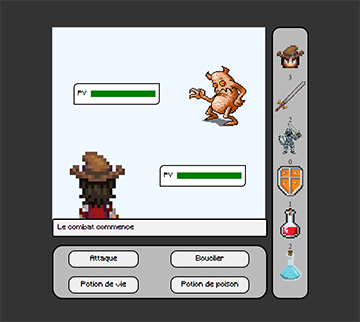

  

<h2>Histoire</h2>

Le personnage se réveille dans un endroit qui lui est inconnu.

Un sentiment de désespoir l’envahit...

"Où suis-je ? — Qui suis-je ? — D'où suis-je arrivé ?" S’écria le personnage.

Le regard perdu, il chercha autour de lui quelque chose qui pouvait le guider... Quelque chose qu’il pouvait reconnaître... Mais rien... Rien ne lui disait quelque chose.

Soudainement, une entité apparaît...

<h2>Contexte</h2>

 Dans le cadre d'un projet d'école en front-end, Nous avons eu 2 semaines pour réaliser un RPG en Javascript.

<h2>Contraintes imposées</h2>

<ul>

<li>Déplacer le personnage à l'aide de touches du clavier</li>
<li>Charger une zone pour que le joueur puisse se déplacer dedans</li>
<li>Naviguer dans différentes zones (par le biais de portes par exemple)</li>
<li>Récupérer des objets en marchant dessus ou en appuyant sur une touche du clavier (une clé par exemple)</li>
<li>Utiliser des objets en appuyant sur une touche du clavier (une clé face à une porte par exemple)</li>
<li>Afficher une zone de texte suite à un événement</li>

</ul>

<h2>Fonctionnnalités supplémentaire</h2>

<ul>

<li>Landing Page avec 'Nouvelle Partie', 'Crédits' et 'Quitter'</li>
<li>Musique et sound effect</li>
<li>Ajout de quête</li>
<li>Collisions sur les bords de la map</li>
<li>Page pour mort du joueur et victoire</li>

</ul>

<h1>Technologies utilisées</h1>

<h2>Front-end</h2>

<h2>Outils</h2>

